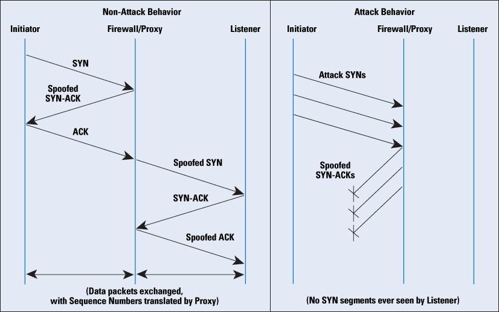
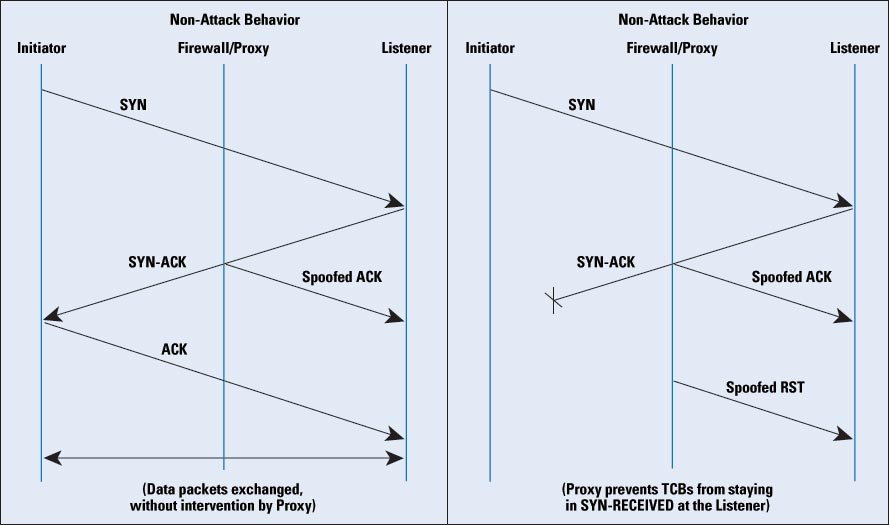

## 什么是 SYN Flood，如何防止这类攻击？

### 一. 什么是SYN Flood攻击
  在进行三次握手时，攻击软件向被攻击的服务器发送SYN连接（握手的第一步）攻击，使服务器无法正常提供服务。这个地址是伪造的，服务器在收到连接请求时将标志位ACK和SYN置1发送给客户端（握手第二部），但是客户端IP地址是伪造的，服务器找不到客户端，这种情况下服务器会重试并等待一段时间后丢弃这个未完成的连接。服务器受到大量这种请求后，服务端将为了维护一个非常大的半连接列表而消耗非常多的资源。此时正常的请求会失去响应；
  
### 二. SYN Flood攻击方式
  1. 直接攻击：攻击者没有经过IP伪装，一般这种通过防火墙即可过滤；
  2. 欺骗式攻击：采用IP地址欺骗的方式；
  3. 分布式攻击：利用网络中主机数量上优势发动分布式SYN洪泛攻击；

### 三. 如何应对SYN Flood攻击
- 高级版本回答
  1. 增加TCP backlog队列；
  2. 减少SYN-RECEIVED的时间：缩短一个TCB从进入SYN-RECEIVED状态到因未进入下一个状态而被回收之间的时间。但是这个方案有一个明显缺点是攻击可以利用因拥塞而丢包的ACK-SYN或者握手而完成的ACK包，这样合法连接的TCB就会由于主机忙于重传这些包而被回收；
  3. SYN缓存：利用一个被限制大小的HASH表空间存放将被分配给TCB的数据，如果接收到握手AC，这些数据将被复制到一个完整的TCB中，否则超出存活时间的HASH将会在需要时被回收。对于一个半开连接的SYN缓存是160字节，而一个完整的TCB是736字节，并且支持15359个SYN缓存空间；
  4. SYN Cookies：
     + 优点：利用SYN Cookies算法将构成连接状态的基本数据压缩进SYN-ACK的序列号（y）比特位里。对于一个合法连接，服务器将收到一个带有序列号（y+1）的ACK报文段，然后基本的TCB数据将被重新生成；
     + 缺点：a. MSS当编码只有3位，因此最多只能使用8重MSS值；
            b. 服务器必须拒绝客户端SYN报文中当其它只在SYN和SYN+ACK中协商的选项，例如Wscale和SACK无法使用；
            c. 增加了密码学运算；
  5. 混合方式：使用backlog队列和SYN Cookies方法联合，当backlog大小超过一定阀值时SYN Cookies才被使用;
  6. 防火墙与代理： 
     
     a. 对连接发起人伪装SYN-ACK包，如果发起连接人是合法的，防火墙/代理就会收到AC，然后在它自己和服务器之间建立连接并伪装连接发起人对地址。防火墙/代理将连接双方分隔开；
     
     
     b. 对服务器伪装ACK包，SYN-ACK的伪装ACK包通过防火墙/代理到达服务器。这种伪装防止服务器的TCB一直停留在SYN-RECEIVED状态，因此保证了backlog队列中的空余空间。防火墙/代理将会停留等待一段时间，如果连接发起人正确的ACK没有被检测到，它将会通过伪装的TCB RET报文使服务器释放TC。对合法的连接，数据包流能够在没有防火墙/代理对影响下继续进行，这种方式优点是合法连接建立以后防火墙/代理不需要直接参与到连接中去；
     
  7. 活动监视器：检测并干预发往服务器的流量的设备，它发现SYN包来源于它知道的攻击者源地址就会立刻发送伪装RST包给服务器；   
  
- 概要版本回答
  1. 缩短（SYN Timeout）超时时间；
  2. 增加最大半连接数；
  3. 过滤网关防护
  4. SYN Cookies技术  

